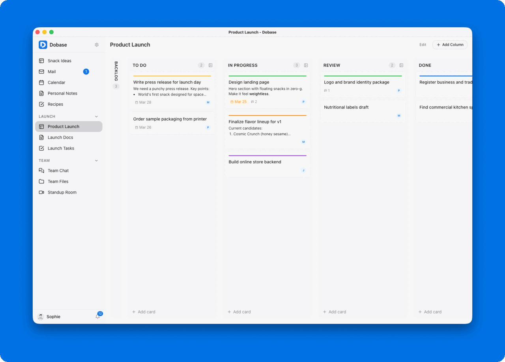

# Dobase

An open-source, self-hosted workspace with installable tools. Add a mail client, kanban boards, documents, chat, file storage, calendars, to-do lists, or video rooms — each shared with collaborators you choose.

Built with Ruby on Rails 8.1, Hotwire, and Tailwind CSS.



## Tools

| Tool | Description |
|------|-------------|
| **Mail** | IMAP/SMTP email client with rich text compose, drafts, contacts, and conversations |
| **Board** | Kanban boards with columns, cards, comments, and attachments |
| **Docs** | Rich text documents with collaborative editing |
| **Chat** | Real-time messaging with typing indicators, replies, and file sharing |
| **Todos** | Task lists with due dates, assignments, comments, and attachments |
| **Files** | File storage with folders, sharing via public links, and previews |
| **Calendar** | CalDAV-compatible calendar with recurring events and local mode |
| **Room** | Video conferencing powered by LiveKit |

## Self-hosting

Dobase runs as a single Docker container. Everything — web server, background jobs, database — is included.

### Install with ONCE

The easiest way to self-host Dobase is with [ONCE](https://once.com) by 37signals. ONCE handles installation, updates, backups, and SSL — all from a simple terminal dashboard.

Point ONCE at:

```
ghcr.io/smgdkngt/dobase:latest
```

That's it. ONCE takes care of the rest — including SSL, persistent storage, and automatic backups. Works on any Linux server, cloud VPS, or even a Raspberry Pi.

All tools work out of the box except the Room (video) tool, which requires an external [LiveKit](https://livekit.io) server. ONCE runs a single container per app, so LiveKit needs to run separately — either via [LiveKit Cloud](https://livekit.io/cloud) or as a standalone Docker container. See [Video conferencing](#video-conferencing-livekit) for setup.

### Deploy with Kamal

For the complete experience — SSL, zero-downtime deploys, LiveKit as an accessory — use [Kamal](https://kamal-deploy.org). All you need is a VPS with Ubuntu.

```bash
git clone https://github.com/smgdkngt/dobase.git
cd dobase
```

Edit `config/deploy.yml` with your server IP and domain, then add secrets to `.kamal/secrets`:

```bash
# .kamal/secrets
SECRET_KEY_BASE=<generate with: bin/rails secret>
SMTP_USERNAME=your-smtp-user
SMTP_PASSWORD=your-smtp-password
```

```bash
kamal setup    # First deploy — provisions server, builds image, starts app
kamal deploy   # Subsequent deploys
```

Kamal handles SSL certificates (Let's Encrypt), asset bridging, and rolling restarts automatically. LiveKit can run as a Kamal accessory — uncomment the `livekit` section in `config/deploy.yml`.

### Docker

```bash
docker run -d \
  -p 80:80 \
  -v dobase_storage:/rails/storage \
  -e SECRET_KEY_BASE=$(openssl rand -hex 64) \
  ghcr.io/smgdkngt/dobase:latest
```

Visit `http://localhost` and sign up.

### Docker Compose

For a persistent setup with all options, clone the repo and use the included `docker-compose.yml`:

```bash
git clone https://github.com/smgdkngt/dobase.git
cd dobase
SECRET_KEY_BASE=$(openssl rand -hex 64) docker compose up -d
```

Or create your own `docker-compose.yml`:

```yaml
services:
  web:
    image: ghcr.io/smgdkngt/dobase:latest
    ports:
      - "80:80"
    environment:
      - SECRET_KEY_BASE=<your-secret>
      - APP_HOST=your-domain.com
    volumes:
      - storage:/rails/storage
    restart: unless-stopped

volumes:
  storage:
```

### Configuration

| Variable | Default | Purpose |
|----------|---------|---------|
| `SECRET_KEY_BASE` | — | **Required.** Generate with `openssl rand -hex 64` |
| `APP_NAME` | `Dobase` | App name in UI, emails, page titles |
| `APP_HOST` | `localhost:3000` | Host for mailer URLs |
| `APP_LOGO_PATH` | `/icon.svg` | Logo path (sidebar, auth pages) |
| `APP_FROM_EMAIL` | `notifications@dobase.co` | Sender address for emails |
| `DISABLE_SSL` | — | Set to `true` for non-TLS deployments (ONCE sets this automatically on localhost) |
| `OPEN_REGISTRATION` | — | Set to `true` to allow public signup (default: invite-only) |

#### Email (SMTP)

Email sending requires SMTP configuration. Without it, all other features work fine — invitation and notification emails just won't be sent.

| Variable | Default | Purpose |
|----------|---------|---------|
| `SMTP_ADDRESS` | — | SMTP server hostname |
| `SMTP_PORT` | `587` | SMTP port |
| `SMTP_USERNAME` | — | SMTP username |
| `SMTP_PASSWORD` | — | SMTP password |

#### Video conferencing (LiveKit)

The Room tool requires a [LiveKit](https://livekit.io) server. All other tools work without it.

LiveKit runs as a separate container — browsers connect to it directly via WebSocket, so it needs its own public URL.

| Method | How to run LiveKit |
|--------|--------------------|
| **Docker Compose** | Uncomment the `livekit` service in `docker-compose.yml` |
| **Docker** | Run `docker run -d -p 7880:7880 -p 7881:7881 -e LIVEKIT_KEYS=key:secret livekit/livekit-server` |
| **Kamal** | Uncomment the `livekit` accessory in `config/deploy.yml` |
| **ONCE** | Run LiveKit separately, or use [LiveKit Cloud](https://livekit.io/cloud) |

| Variable | Default | Purpose |
|----------|---------|---------|
| `LIVEKIT_URL` | — | **Public** WebSocket URL browsers connect to (e.g. `wss://room.your-domain.com`) |
| `LIVEKIT_API_KEY` | — | LiveKit API key |
| `LIVEKIT_API_SECRET` | — | LiveKit API secret |

Example with Docker Compose (uncomment in `docker-compose.yml`):

```yaml
livekit:
  image: livekit/livekit-server:latest
  ports:
    - "7880:7880"
    - "7881:7881"
  environment:
    - LIVEKIT_KEYS=your-api-key:your-api-secret
  restart: unless-stopped
```

Then add to the web service environment:

```yaml
- LIVEKIT_URL=wss://room.your-domain.com
- LIVEKIT_API_KEY=your-api-key
- LIVEKIT_API_SECRET=your-api-secret
```

### Storage & backups

All data lives in `/rails/storage` (SQLite database + uploaded files). Back up this volume regularly.

## Development

### Requirements

- Ruby 3.4+
- SQLite 3
- libvips (for image processing)

### Setup

```bash
git clone https://github.com/smgdkngt/dobase.git
cd dobase
bin/setup
```

Or manually:

```bash
bundle install
bin/rails db:prepare
bin/dev
```

The app runs at `http://localhost:3000`.

### Demo data

Seed the database with a fictional company ("Moonshot Snacks") to explore all tools:

```bash
SEED_DEMO=1 bin/rails db:seed
```

Log in as `sophie@moonshot-snacks.com` / `password123`.

### Commands

```bash
bin/dev                    # Start dev server (Rails + Tailwind watcher)
bin/rails test             # Run tests
bin/rails test:system      # Run system tests
bin/rubocop                # Lint Ruby
bin/brakeman --quiet       # Security analysis
```

## License

[MIT License](LICENSE.md)
